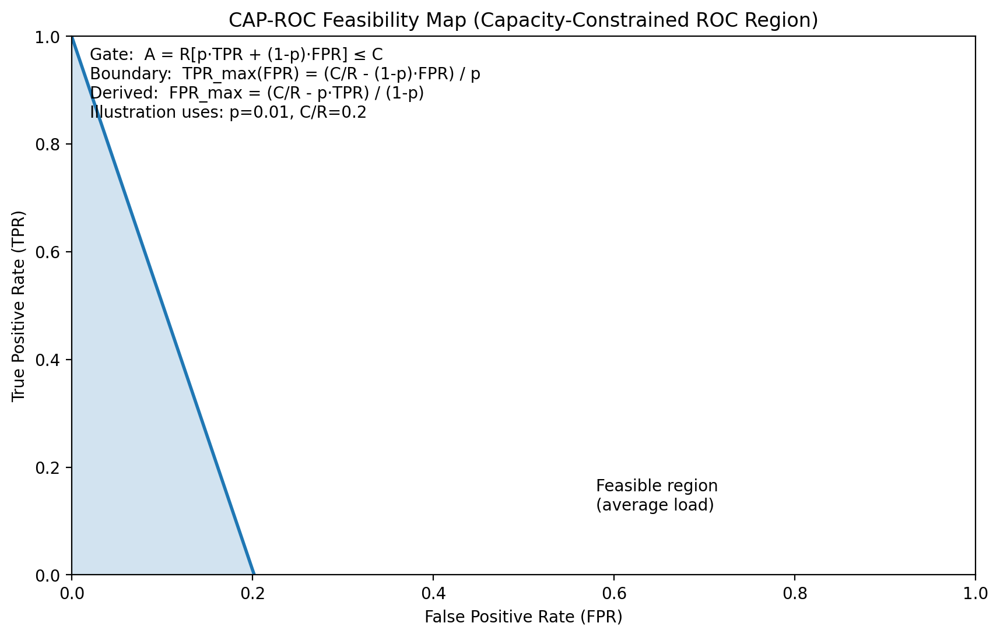
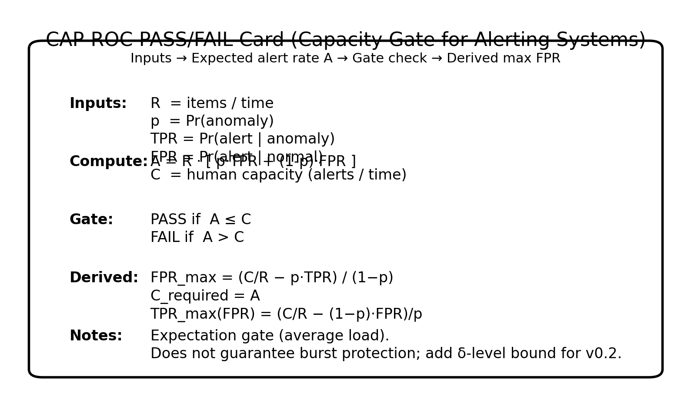

# CAP-ROC v0.2 — Capacity-Constrained ROC Feasibility (delta gate)

CAP-ROC includes an expectation gate and an optional δ-level overload gate under a Poisson model. It does not model bursty/clustered arrivals; use an overdispersed model (e.g., Negative Binomial) if logs show overdispersion.

It answers one hard question before you ship:

> **Can humans keep up with the alert stream at this operating point?**





## The gate (one line)

Define expected alert rate:

\[
A = R\,[p\,TPR + (1-p)\,FPR]
\]

A system is **capacity-stable** (in expectation) if:

\[
A \le C
\]

Where:

- `R` = incoming item rate (items / time)
- `p` = base anomaly rate `Pr(anomaly)`
- `TPR` = `Pr(alert | anomaly)`
- `FPR` = `Pr(alert | normal)`
- `C` = human review capacity (alerts / time)

Equivalent (solve for max allowable false positives):

\[
FPR_{max} = \frac{C/R - p\,TPR}{1-p}
\]

If `C/R - p*TPR < 0`, you're over capacity even with `FPR = 0`.

## Why CAP-ROC exists

Traditional model metrics (AUC, accuracy) can look “great” while the **ops reality** is unusable:

- rare events (`p` small) + modest `FPR` + high volume (`R`) ⇒ alert fatigue, backlog, missed true events

CAP-ROC makes capacity an explicit constraint rather than an afterthought.

## What’s in this repo

- `docs/`  
  - `CAP-ROC_v0.1_SparkVault_Standard.docx` — the standard (definitions, checklist, example, required consistency checks)
- `src/`  
  - `cap_roc_tool.py` — reference CLI calculator
- `examples/`  
  - `cap_roc_examples.txt` — example runs and notes


## The δ (delta) gate (tail-risk protection)

CAP-ROC v0.1 is an **expectation gate**: it checks whether the *average* alert rate fits within human capacity.

CAP-ROC v0.2 adds an optional **δ-level overload gate** under a Poisson model for alert counts per time unit:

- Let the expected alert rate be:
  \[
  \lambda = A = R\,[p\,TPR + (1-p)\,FPR]
  \]
- Model the number of alerts in one time unit as:
  \[
  N \sim \mathrm{Poisson}(\lambda)
  \]
- Choose a risk target δ (e.g., 0.01) and require:
  \[
  \Pr(N > C) \le \delta
  \]

Define \(\lambda_{\max}(\delta, C)\) as the largest mean such that \(\Pr(\mathrm{Poisson}(\lambda_{\max}) > C) \le \delta\).
Then the δ gate requires:

\[
A \le \lambda_{\max}(\delta, C)
\]

This implies a δ-level bound on false positives:

\[
FPR_{\max}^{\delta} = \frac{\lambda_{\max}/R - p\,TPR}{1-p}
\]

**Implementation note:** for small capacities (e.g., C ≤ 10) the normal approximation can be inaccurate; the reference tool computes \(\lambda_{\max}\) by exact Poisson tail inversion (binary search).


## Quickstart

### Requirements
- Python 3.9+ (no external packages required)

### Run the calculator

```bash
python src/cap_roc_tool.py --R 20 --p 0.01 --tpr 0.85 --fpr 0.30 --C 4
```

You’ll get:

- expected alert rate `A`
- **PASS/FAIL** on `A <= C`
- `FPR_max` (given `R, p, TPR, C`)
- `C_required` (capacity needed for the chosen `TPR, FPR`)
- `TPR_max` (max sensitivity feasible at that `FPR`)

## Example: ICU sepsis alerting (capacity check)

Assume:

- `R = 20` patient-hour windows/hour
- `p = 0.01`
- `TPR = 0.85`
- capacity `C = 4` alerts/hour

Then:

\[
FPR_{max} \approx \frac{0.2 - 0.0085}{0.99} \approx 0.193
\]

If your operating point has `FPR > 0.193`, you are engineering overload **by design** (on average).

## Recommended workflow (SparkVault-style discipline)

1. **Generate** your math/spec output  
2. **Consistency check** (required): definitions, ratio direction, units, edge cases, recompute example  
3. **Decide + log**: record `R, p, TPR, FPR, C`, PASS/FAIL, mitigation plan

See the DOCX standard for the decision-log template.

## Common mitigations when CAP-ROC fails

- raise threshold (reduce `FPR`)
- add multi-stage triage (filter → stronger model → human)
- scope the problem to raise `p` (focus on higher-risk subsets)
- increase capacity `C` (staffing / workflow redesign / automation)
- choose a longer time unit only if latency remains acceptable

## Limitations (by design)

CAP-ROC includes an **expectation gate** (average load) and an optional **δ-level overload gate** under a Poisson model.
It does not model bursty/clustered alert arrivals; if your logs show overdispersion, consider an overdispersed model (e.g., Negative Binomial) for tail risk.


## Versioning

- Standard: `v0.2` (delta gate) — 2025-12-18


## License

MIT (see `LICENSE`).


## Worked example (fraud / high-volume review)

Assume (per day):

- Incoming transactions: `R = 10,000,000`
- Base fraud rate: `p = 0.001` (0.1%)
- Operating point: `TPR = 0.90`, `FPR = 0.01`
- Human review capacity: `C = 110,000` alerts/day
- δ gate: `δ = 0.01` (1% chance of exceeding capacity on a given day, Poisson model)

Run:

```bash
python src/cap_roc_tool.py --R 10000000 --p 0.001 --tpr 0.90 --fpr 0.01 --C 110000 --delta 0.01
```

Interpretation:

- If the mean gate fails, you will overload reviewers on average.
- If the δ gate fails, you may be “fine on average” but still exceed capacity too frequently (bad days become routine).

